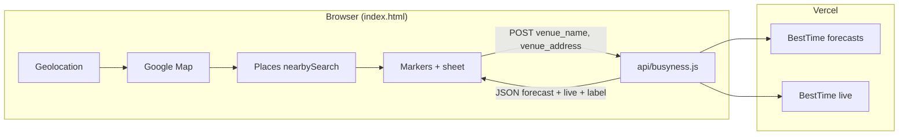

# Quiet Cup — Architecture (current repo)

## File tree

```
/
├── index.html          # Entire frontend: HTML structure, Tailwind CDN, inline CSS, vanilla JS
├── api/
│   └── busyness.js     # Vercel serverless: BestTime forecast + live, cache, JSON API
├── vercel.json         # Rewrite: serve index.html for all paths except /api/*
├── PRD.md
├── claude.md
├── planning.md
└── tasks.md
```

No `package.json`, no build step, no framework entrypoints.

## Runtime components

### Frontend (`index.html`)

- **Map:** `google.maps.Map` with custom **style JSON** (muted landscape/water, POI/transit label reduction).
- **Geolocation:** `navigator.geolocation.getCurrentPosition` with timeout / high accuracy; fallback center **37.7749, -122.4194**.
- **Cafes:** `google.maps.places.PlacesService.nearbySearch` — `type: "cafe"`, **radius 800** (meters).
- **Markers:** `google.maps.Marker` with **data-URL SVG** icons; colors from thresholds on **0–100** busyness (`#22c55e` / `#f59e0b` / `#ef4444`). Selected marker scales slightly and gets higher z-index.
- **Search:** `google.maps.places.Autocomplete` on the top input; on `place_changed`, pan + zoom 15 and refresh search from new center.
- **Bottom sheet:** DOM show/hide + backdrop; fetches **`POST /api/busyness`** with `AbortController` on close.
- **Chart:** JS builds 24 columns; bars scaled to max of the day’s `forecast` array; current **local** hour highlighted.

### Backend (`api/busyness.js`)

- Node handler: reads **JSON body** from `req` stream.
- **POST only**; returns **405** for other methods.
- Requires env **`BESTTIME_PRIVATE_KEY`**.
- Calls BestTime:
  1. **`POST`** `https://besttime.app/api/v1/forecasts` with query params `api_key_private`, `venue_name`, `venue_address`.
  2. **`POST`** `https://besttime.app/api/v1/forecasts/live` with same params.
- Picks **today’s** `analysis` entry by matching `day_info.day_int` to JS weekday (Monday=0 … Sunday=6 mapping).
- Converts BestTime **`day_raw`** (6 AM–5 AM window indices) to **clock hours 0–23** for the client chart.
- **`extractLiveNumbers`:** tolerates object vs array `analysis` and several possible field names for live / forecasted busyness.
- If live call fails, **`live`** falls back to **`forecastThisHour`**.
- **`label`:** derived from the same thresholds as the old `busynessLabel` helper.
- **`venueOpen`:** returned as **`null`** (not yet wired to `day_info` / `venue_open_close_v2`).

### Deploy (`vercel.json`)

- Single-page rule: anything not under **`api/`** is rewritten to **`/index.html`** so deep links still load the app.

## Data flow (happy path)



## Key design decisions

1. **No npm / no bundler** — fastest deploy and edit on constrained devices; tradeoff: Maps key in page config pattern.
2. **Private BestTime key only on server** — client never sees `BESTTIME_PRIVATE_KEY`.
3. **Server-side cache** — reduces BestTime credit use; **in-memory** only (resets on cold starts).
4. **Default marker color before fetch** — avoids N parallel forecast calls for every pin on load.
5. **Same-origin `/api/busyness`** — expects deployment where HTML and function share the Vercel project origin.

## Environment variables (Vercel)

| Variable | Where |
|----------|--------|
| `BESTTIME_PRIVATE_KEY` | Server (`api/busyness.js`) |

Maps key is **not** an env var in repo code; set **`window.STREET_WHISPERER_GMAPS_KEY`** in `index.html` (or inject at deploy).
